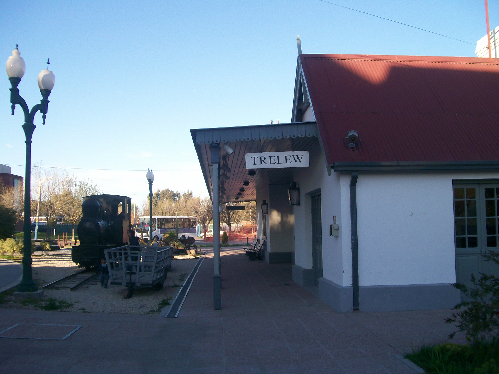
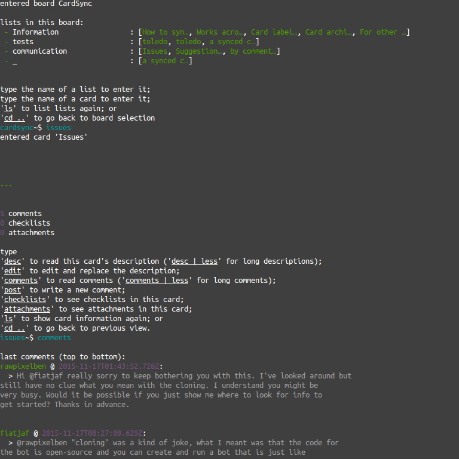

# trelew



### An immersive command line app for Trello

_Nodejs 4 is required. If yours is below that, please follow instructions [here](http://stackoverflow.com/a/10076029/973380) to upgrade._

## Install

```
npm install trelew --global
```

## Run

```
trelew
```



On the first run you'll be asked to generate a token.

After that, you can navigate between your boards, lists and cards just by typing their name (just start typing and press TAB for autocompletion). For visualizing available options and information about current board/list/card, use `ls`.

Once in a list, use `add card` to create a new card.

Once in a card, use `ls` to read its descrition, `edit` to edit the description, `comments` to read the last comments, `add comment` or `post` to add a new comment, `checklists` and `attachments` to see checklists and attachments.

`cd ..` will go back to the previous level.

`?` or `help` will show the available commands.

At any time you can do `ls | less` (or `comments | less`). This can be useful to read long descriptions or comments.
